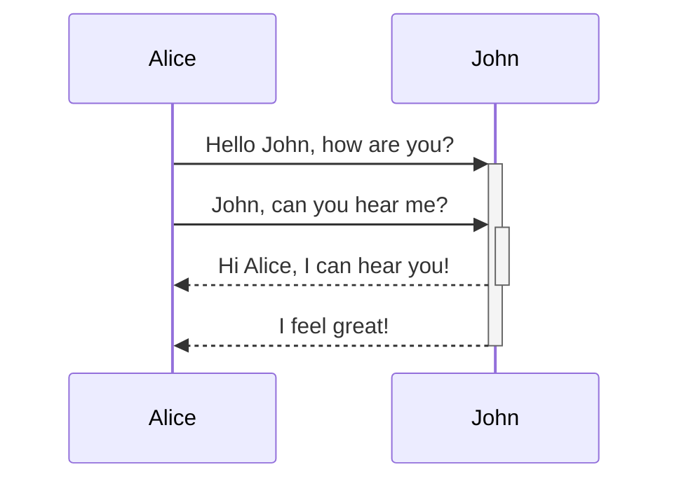

```

# npx create-nx-workspace@latest gb-nx --defaultBase master --preset=empty --no-nx-cloud
# npx create-nx-plugin@latest gb-nx browser --createPackageName="" --no-nx-cloud
npx create-nx-workspace@latest gb-nx --defaultBase master --workspaceType=integrated --preset=empty --no-nx-cloud
cd .\gb-nx\
npm add @nx/plugin -D
npx nx g @nx/plugin:plugin --name=browser --directory=packages/browser --importPath=@gb-nx/browser --publishable=true
npx nx g @nx/plugin:plugin --name=cli --directory=packages/cli --importPath=@gb-nx/cli --publishable=true
npx nx g @nx/plugin:plugin --name=junit --directory=packages/junit --importPath=@gb-nx/junit --publishable=true
npx nx g @nx/plugin:plugin --name=svelte --directory=packages/svelte --importPath=@gb-nx/svelte --publishable=true
npx nx g @nx/plugin:plugin --name=workspace --directory=packages/workspace --importPath=@gb-nx/workspace --publishable=true
npx nx run-many --target lint --verbose

npx nx g @nx/plugin:generator --name=extension --project browser
npx nx g @nx/plugin:generator --name=init --project browser
npx nx g @nx/plugin:generator --name=application --project cli
npx nx g @nx/plugin:generator --name=command --project cli
npx nx g @nx/plugin:generator --name=init --project cli
npx nx g @nx/plugin:generator --name=refresh --project cli
npx nx g @nx/plugin:generator --name=add-junit --project junit
npx nx g @nx/plugin:generator --name=application --project svelte
npx nx g @nx/plugin:generator --name=component --project svelte
npx nx g @nx/plugin:generator --name=dependency --project svelte
npx nx g @nx/plugin:generator --name=init --project svelte
npx nx g @nx/plugin:generator --name=route --project svelte
npx nx g @nx/plugin:executor --name=build --project browser
npx nx run-many --target lint test --verbose
npx nx format --all
```


